# webBuy
E-commerce with Rest API & an App  
<ul>
<li>Rest API</li>
<li>Entity Framework</li>
<li>Code First Approach</li>
<li>App (jQuery, Bootstrap-4.6, Basic javascript & CSS, HTML)</li>
<li>App with single page application & layout (manually)/li>
<li>App is used ajax for all types of action/li>
</ul
  
__Snapshots of Admin panel__

> Last five added products in carousel with welcome (before login)
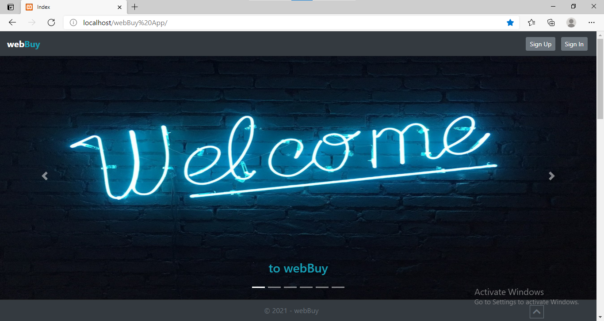

> All products search (before login)
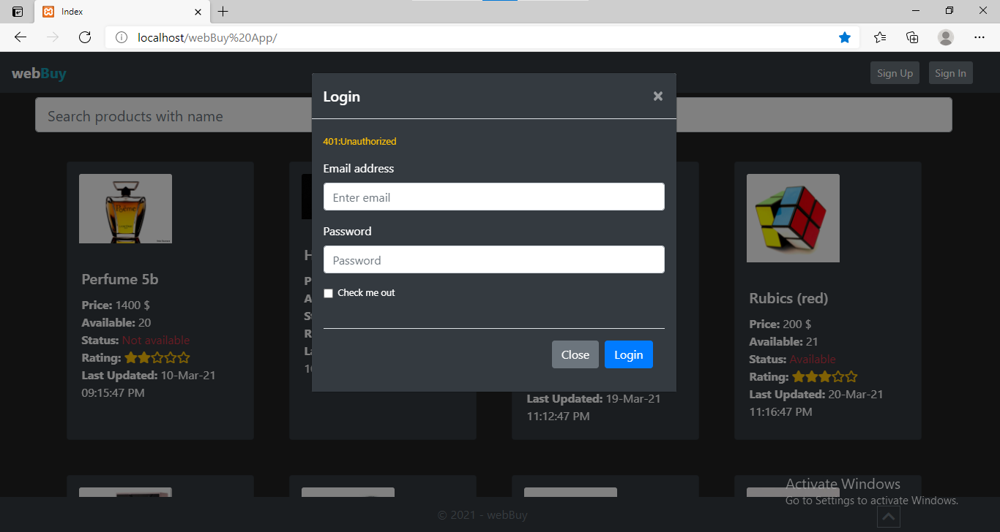

> Navigation Menu
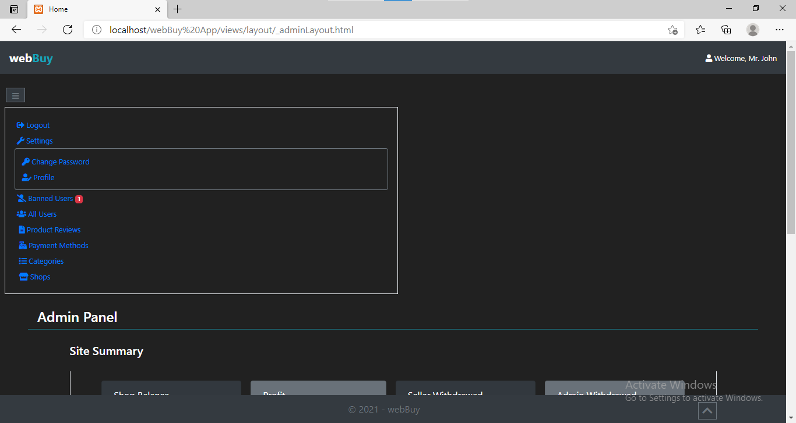

> Home
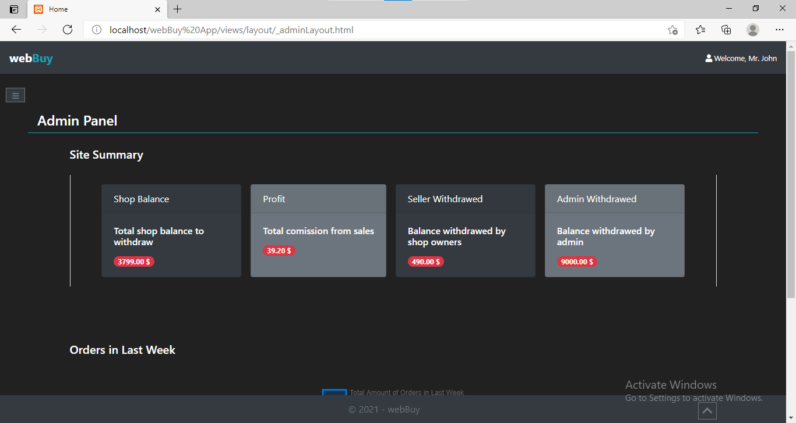

> Total order chart in last seven days
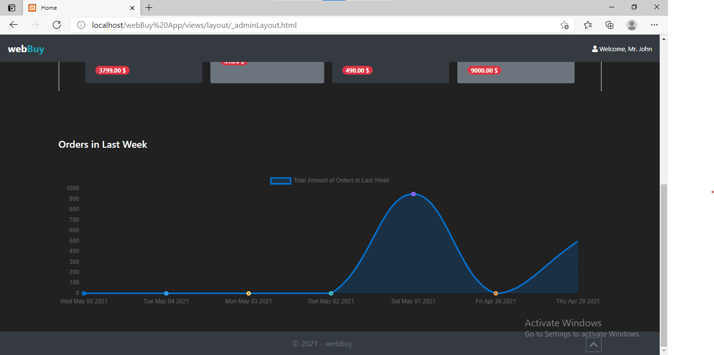

> Ban-unban all users
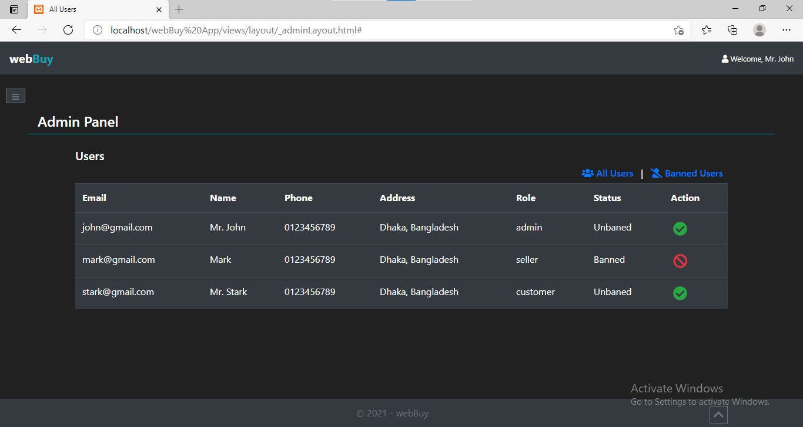

> Reviews of each Product
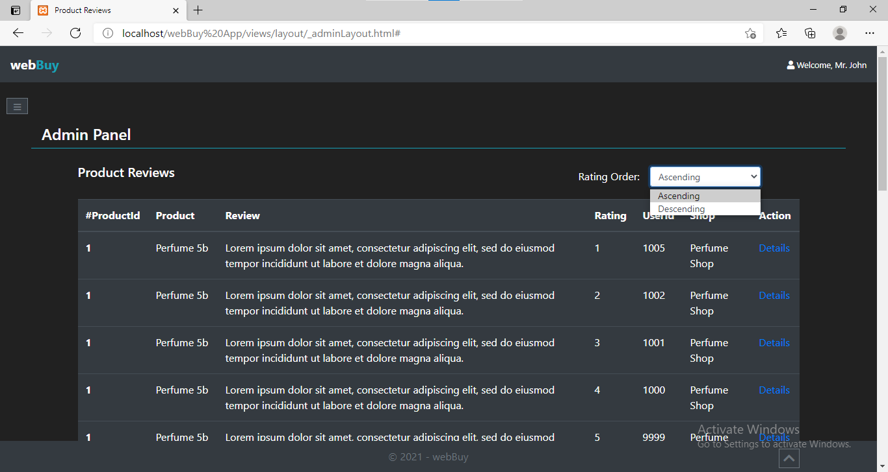

> Review chart
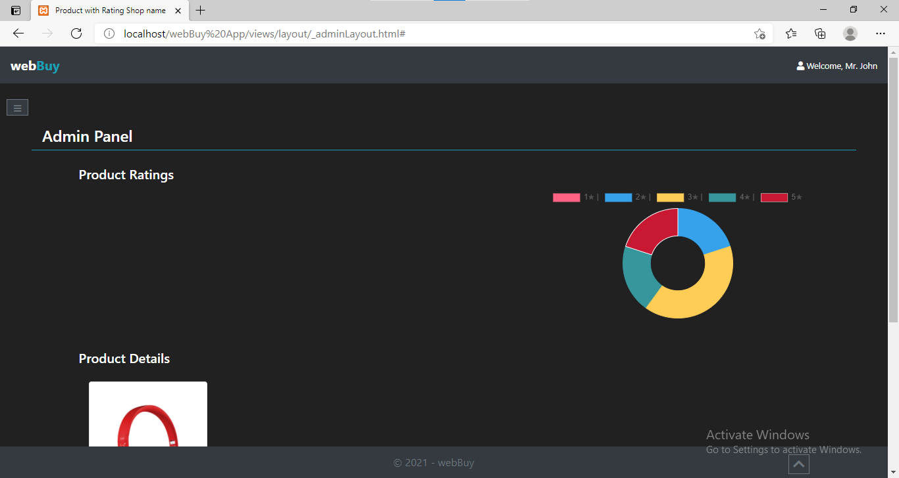

> Shops
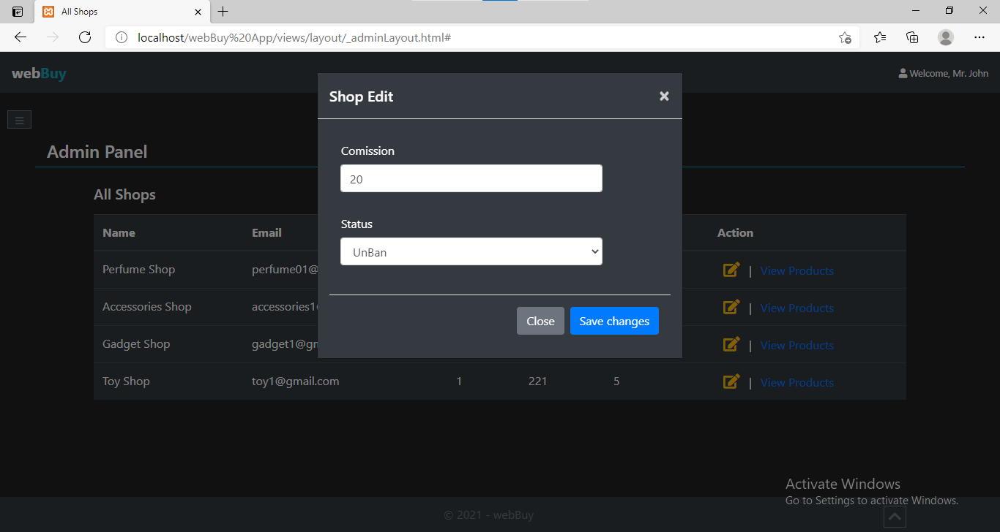

> Specific shop products
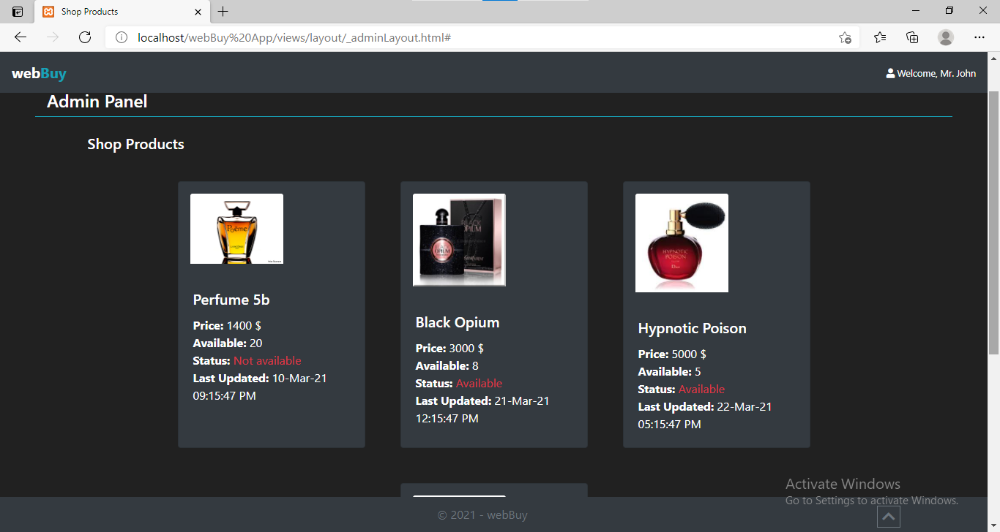

> Payment methods
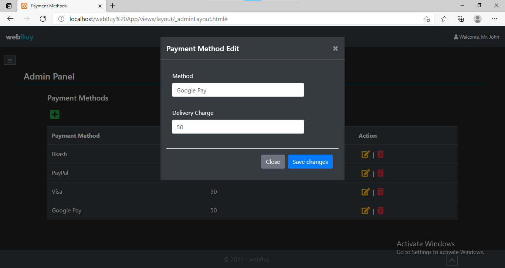

